# 🚀 Banking App – DevSecOps CI/CD Pipeline

## 📌 Project Overview

This project demonstrates a **complete DevSecOps CI/CD pipeline** for a Java Spring Boot application using Jenkins, Docker, and Trivy, along with monitoring via Prometheus and Grafana.

The pipeline automates:

* Build
* Containerization
* Security scanning
* Deployment
* Monitoring

---

## 🏗️ Architecture

```
GitHub → Jenkins → Maven Build → Docker Build → Trivy Scan → Deploy Container → Monitoring (Prometheus + Grafana)
```

---

## ⚙️ Tech Stack

* ☕ Java (Spring Boot)
* 📦 Maven
* 🐳 Docker
* 🔁 Jenkins
* 🔐 Trivy (Security Scan)
* 📊 Prometheus
* 📈 Grafana
* ☁️ AWS EC2 (used during implementation)

---

## 📂 Project Structure

```
banking-app/
├── src/
├── target/
├── Dockerfile
├── pom.xml
└── README.md
```

---

## 🔄 Jenkins Pipeline Stages

### 1️⃣ Clean Workspace

Removes old files before build

### 2️⃣ Clone Code

Pulls code from GitHub repository

### 3️⃣ Build Application (Maven)

```
mvn clean package -DskipTests
```

### 4️⃣ Docker Build

```
docker build -t banking-app .
```

### 5️⃣ Security Scan (Trivy)

```
trivy image --exit-code 1 --severity HIGH,CRITICAL banking-app
```

➡️ Pipeline fails if HIGH/CRITICAL vulnerabilities are detected

### 6️⃣ Run Container

```
docker run -d -p 8080:8080 banking-app
```

---

## 🔐 Security – Trivy Scan

* Scans Docker image for vulnerabilities
* Detects CVEs in:

  * OS packages
  * Java dependencies
* Ensures secure deployment by failing pipeline on critical risks

---

## 🌐 Application Access

> ⚠️ EC2 instance was used during implementation and is currently terminated.
> Below screenshots demonstrate the working application.

---

## 📊 Monitoring Setup

### 🔹 Prometheus

* Used to collect application and system metrics

---

### 🔹 Grafana

* Used to visualize metrics via dashboards

---

## 📸 Screenshots

### ✅ EC2

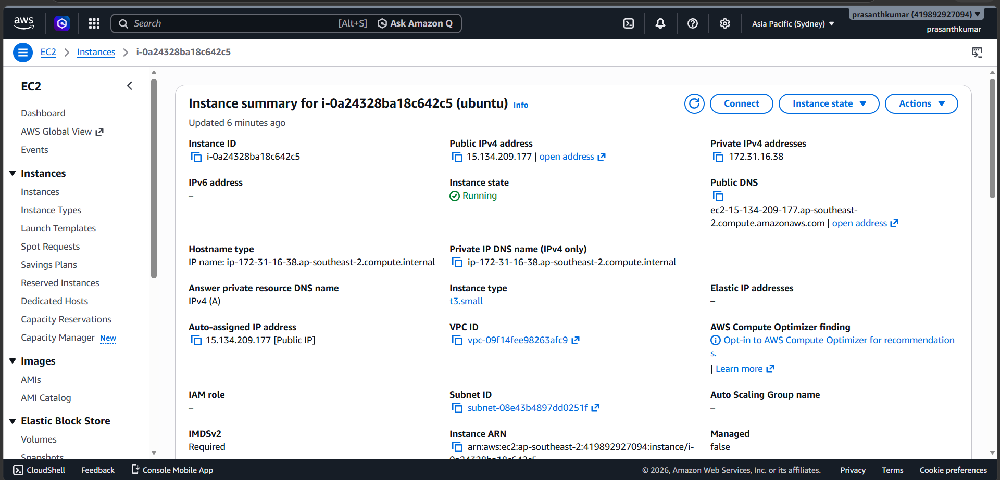

---

### ✅ Jenkins Pipeline – SUCCESS

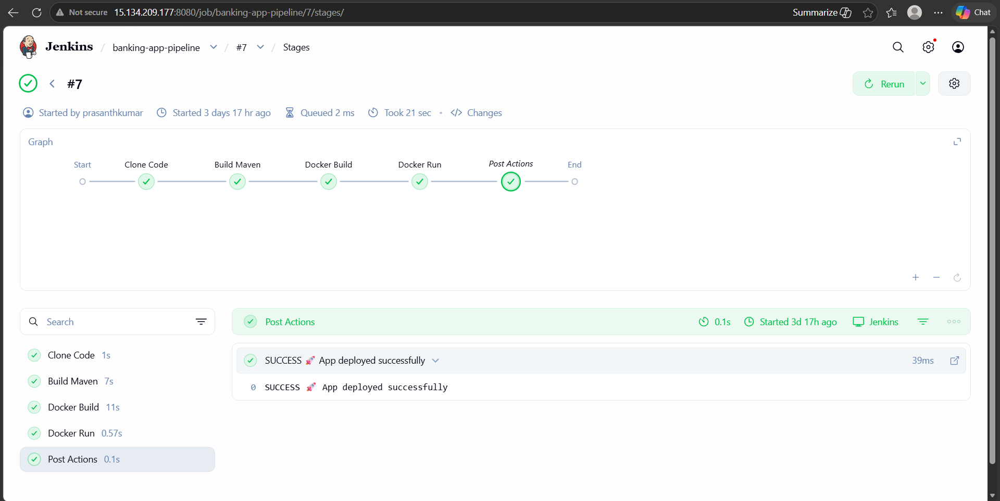

---

### 🌐 Application Running (Docker)

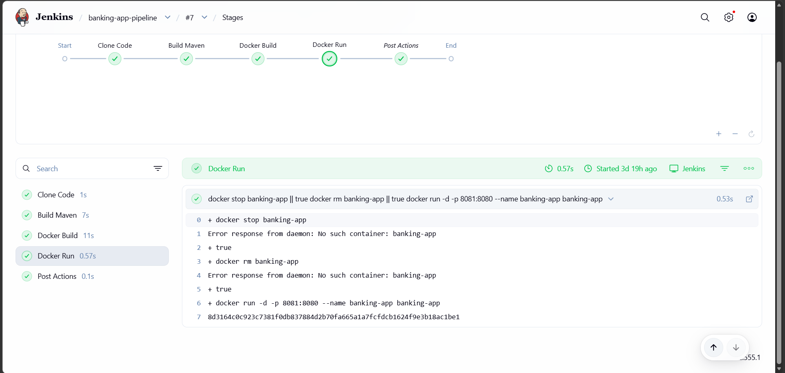
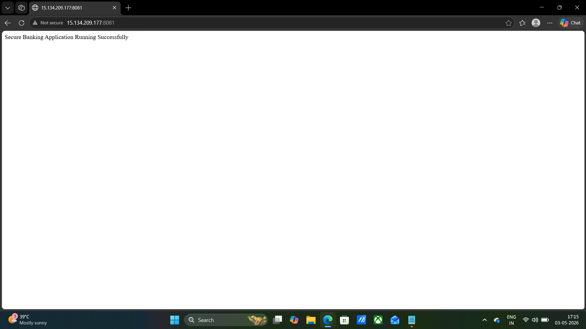

---

### 📊 Prometheus Dashboard

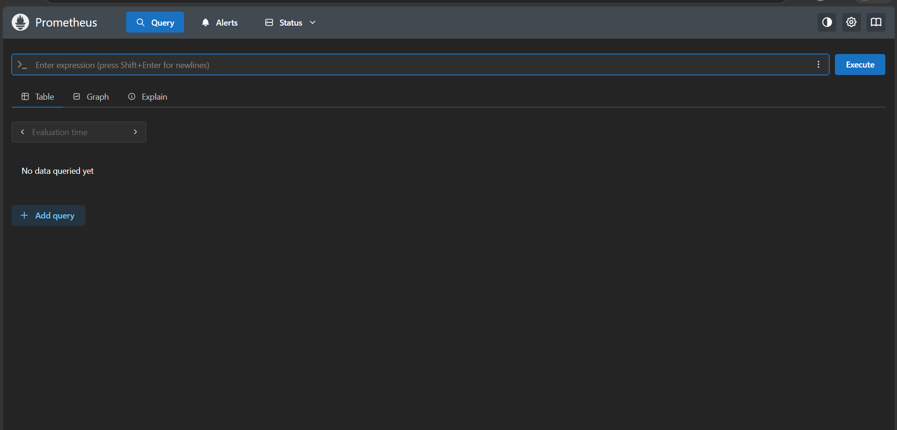

---

### 📈 Grafana Dashboard

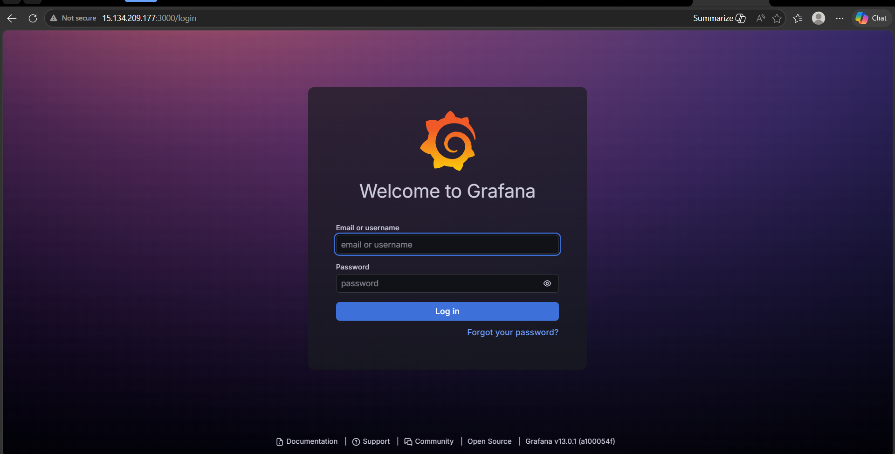
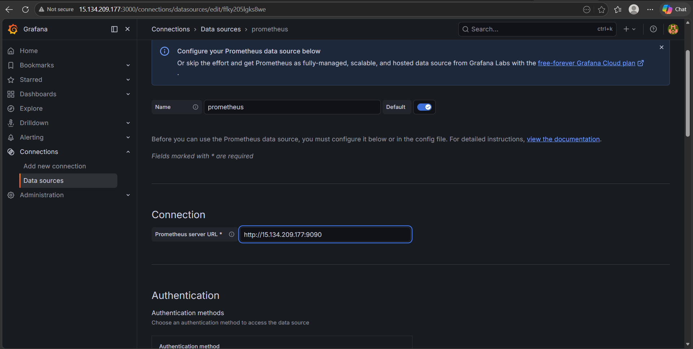
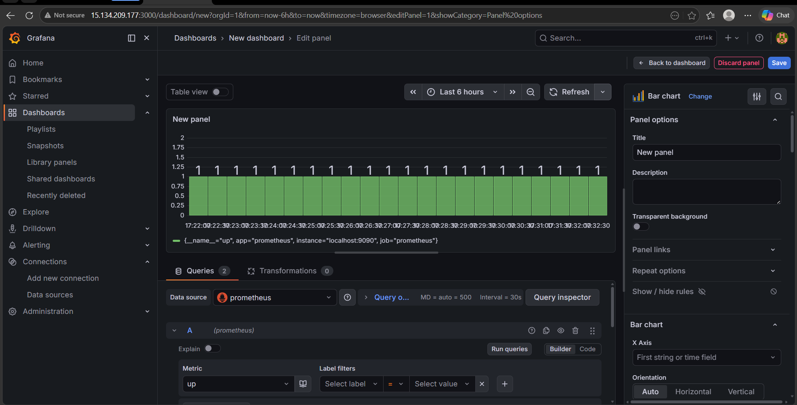

---

### ❌ Jenkins Pipeline – FAILED (Trivy Scan)

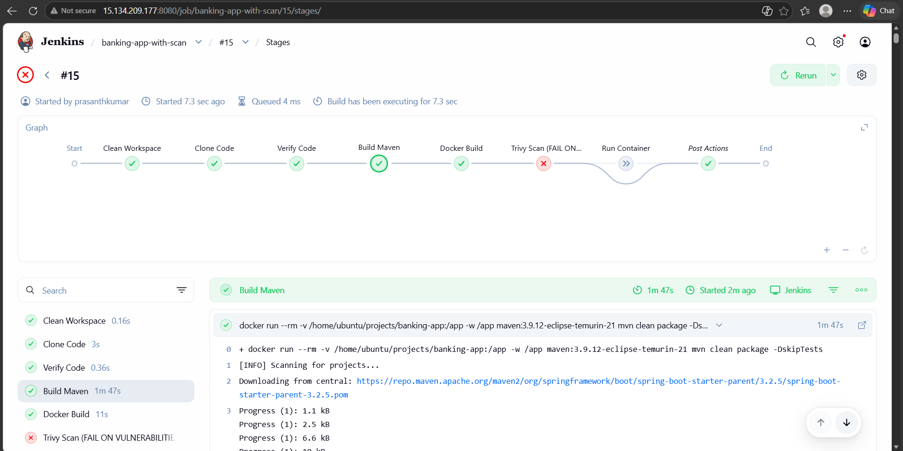
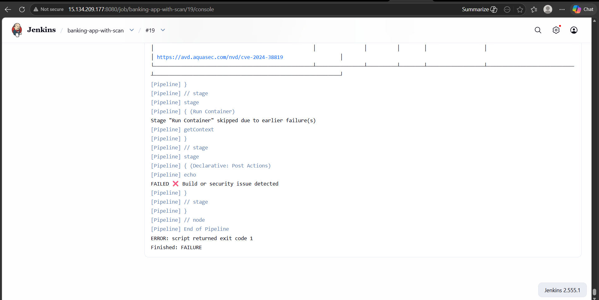

---

### ⚠️ Vulnerability Report (Trivy)

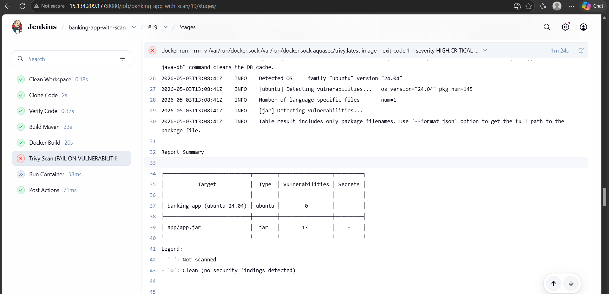


---

## 🧠 Key Learnings

* Built end-to-end CI/CD pipeline using Jenkins
* Integrated Docker for containerization
* Implemented DevSecOps with Trivy security scanning
* Handled real-world issues:

  * Disk space errors
  * Docker permissions
  * Jenkins workspace paths
* Set up monitoring using Prometheus & Grafana

---

## 🚀 Future Enhancements

* Push Docker image to DockerHub / ECR
* Integrate SonarQube for code quality analysis
* Deploy application on Kubernetes
* Add alerting system in Grafana

---

## 👨‍💻 Author

**Prasanth Kumar**
DevOps Engineer | AWS | Docker | Jenkins | Kubernetes

---
